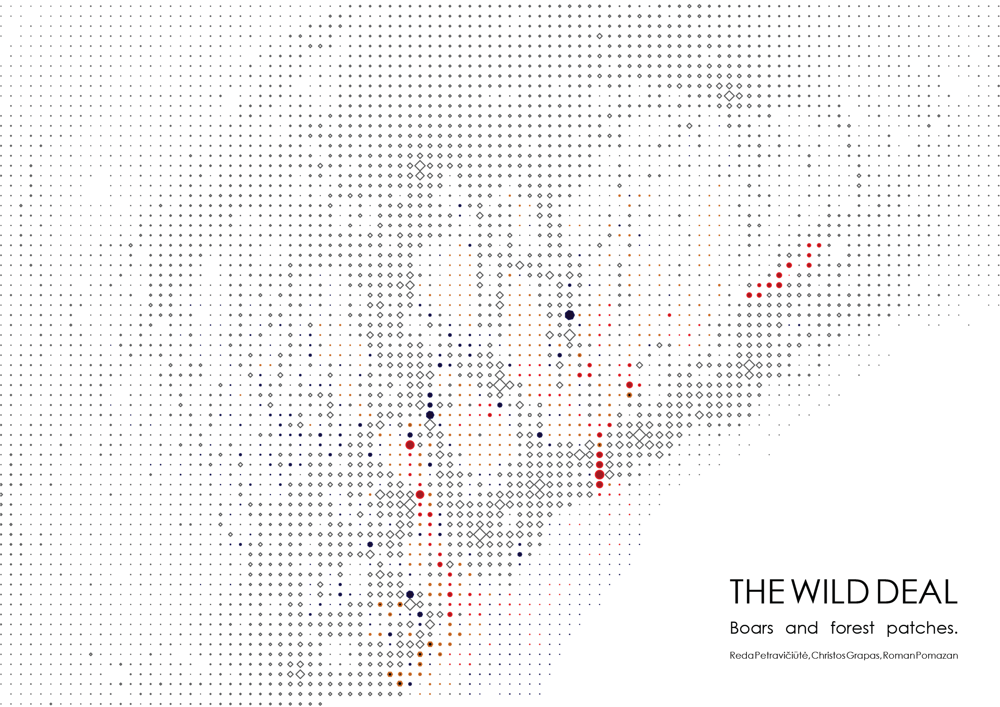
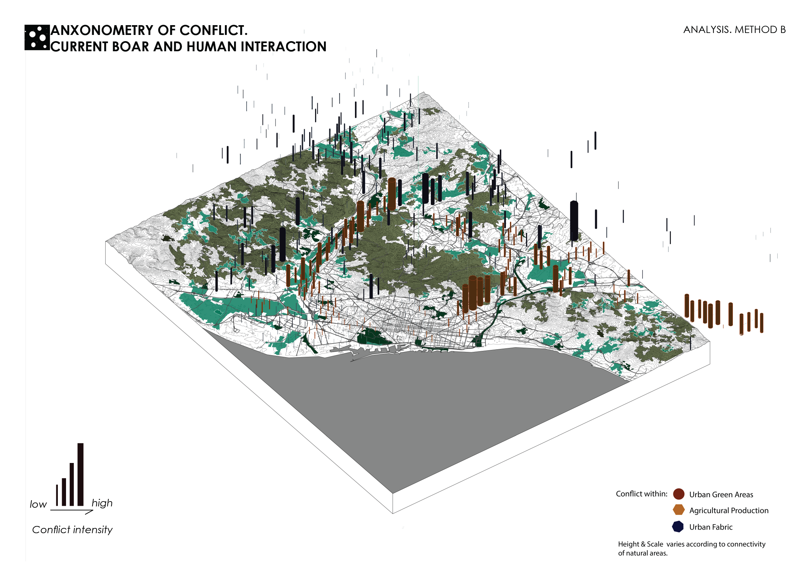
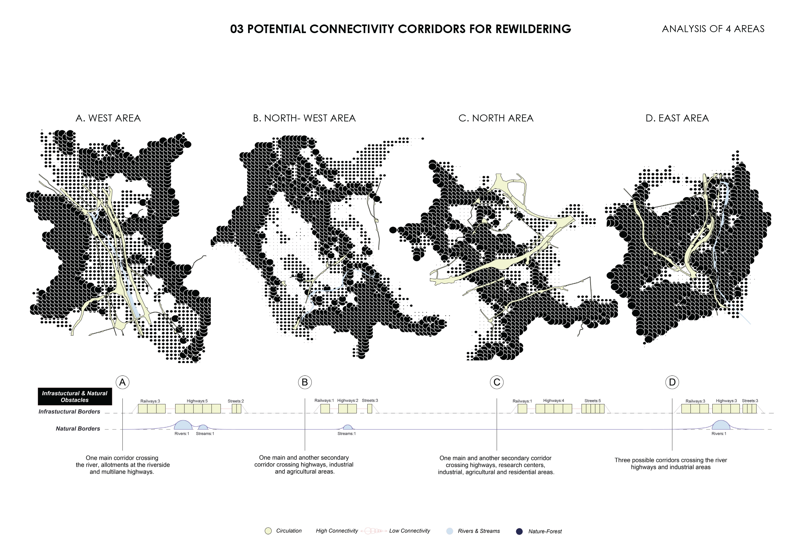
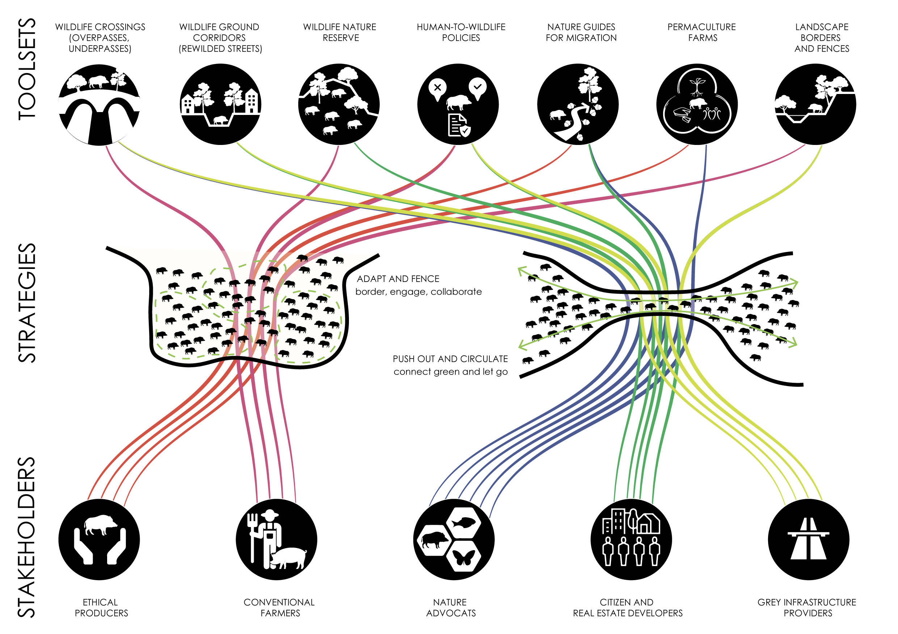
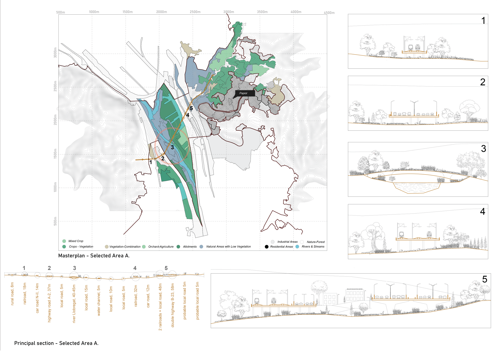
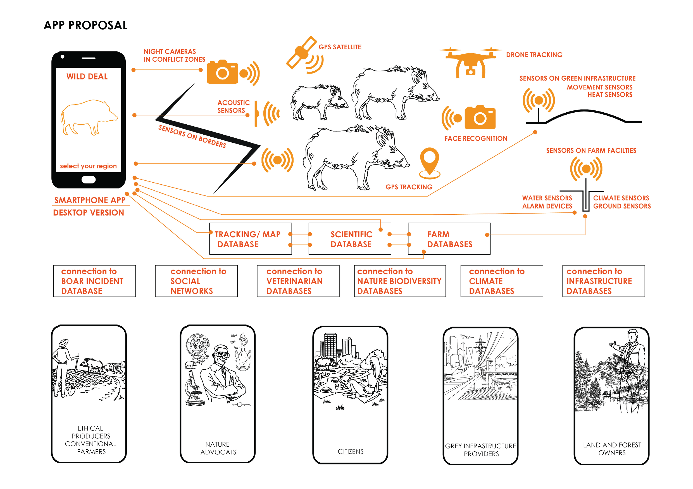

# Internet of Boars
## Research of options for coexistence of wild animals with humans within anthropocene landscapes.  
Reda Petravičiūtė, Christos Grapas, Roman Pomazan 
Research is aimed at identifying lines of conflict between humans and wild boars, diagnosing its preconditions and development, and proposing ways for reconciliation.  
tools: Grasshopper (Rhinoceros 3d 7), Hops, EarthEngine, Geojson, Circuitscape, QGIS, illustrator, Photoshop, Urbano.
## What I learned: 
- Data mining with Earth Engine and Hops plugin for Grasshopper.
- Data vizualisation of predicted tracing of migration of wild animals.
- Methods of bibliographic analysis.
- Map vizualisation with Grasshopper using Hops plugin, CORINE Land Cover CLC 2018 from the Earth Engine Data Catalog.
- Methods of overlappind map data with Grasshopper and QGIS.
## Key takeaways
- We live in the Anthropocene, when humans have colonized all landscapes and deprived animals of their natural habitats, forcing them to move into "special" natural reserve zones.
- Natural reserve zones are often disconnected, obstructing animals from migrating.
- Very often natural landscapes are segmentated by linear infrastructure, industrial and agricultural patches.
- In contrast, animals are attracted to rich-for-food urbanized areas, and the more they find urban food, the more they are transforming into urban animals, especially this rule applies to the boar.
- Wild animals invide urban landscapes for food search from segmentated natural habitats, that is perceived by humans as agression and often causes an [urgent negative reaction] (https://www.theanimalreader.com/2022/08/17/news-barcelona-kills-wild-boars-to-protect-humans/)
- the most invaded-by-animals areas correlate with the most prosperous neighborhoods
- several options to resolve the conflict: connection of natural landscapes by wildcrossings, seasonal animal rights for the city, collaboration of permaculture farms and animals
  
## methodology
1. overlapping data and merging maps with Grasshoper. [source>>](221104_AXO_CONNECTIVITY_LANDUSES_Roman ed02.gh)
2. generating animal migration.[source>>](221024_Barcelona_Resistance_3D.gh)
3. parametric scheme [source>>](stakeholder scheme connection.gh)
   
## data visualization
### Factsheet of wildboar behaviour in the metropolitan Barcelona.

### Processed histogram map depicting the conflict zones.

### Land Cover Map of natural habitats of wild boar in the Metropolitan Barcelona.

### Generated map of animals' migrations according the resistance codes of land covers.

### Generated axonometric map of potential conflict points between humans and animals.

### Generated axonometric map of categorized potential conflict points.

### Map of potential connections between wild habitats. Approaching resolution.

### Processed maps of connectivity corridors

### Map of rewildering connectivity. Wildlife Crossing Tools

### Stakeholders' scheme

### Sketch masterplan of the pilot wildlife crossing

### Application proposal for monitoring of the project

##  References
- "Behavioral state resource selection in invasive wild pigs in the Southeastern United States," [Nature](https://www.nature.com/articles/s41598-021-86363-3#Tab2).
- "Normal and Abnormal Behaviours of Swine under Production Conditions," [The Pig Site](https://www.thepigsite.com/articles/normal-and-abnormal-behaviours-of-swine-under-production-conditions).
- González Crespo, "The synurbization of wild boar in the city of Barcelona, Spain, 2020," [TDX](https://www.tdx.cat/handle/10803/671607#page=1).
- Justus Hagemann, Carles Conejero, Milena Stillfried, Gregorio Mentaberre, Raquel Castillo-Contreras, Jörns Fickel, Jorge Ramón López-Olvera, "Genetic population structure defines wild boar as an urban exploiter species in Barcelona, Spain," Science of The Total Environment, Volume 833, 2022, 155126, ISSN 0048-9697, [ScienceDirect](https://doi.org/10.1016/j.scitotenv.2022.155126) ([Direct Link](https://www.sciencedirect.com/science/article/pii/S0048969722022197)).
- Catalonia Wild boar conservation program, [SEnglar](https://senglar.cat/programa-de-seguiment/).
- Dogan, T., Yang, Y., Samaranayake, S., & Saraf, N. (2020). "Urbano: A tool to promote active mobility modeling and amenity analysis in urban design," Technology| Architecture+ Design, 4(1), 92-105. [Food4Rhino](https://www.food4rhino.com/en/app/urbano#downloads_list).
- "Boar wars: how wild hogs are trashing European cities," [The Guardian](https://www.theguardian.com/world/2019/jul/30/boar-wars-how-wild-hogs-are-trashing-european-cities).
- "El senglar no és benvingut a ciutat," [Barcelona Metròpolis](https://www.barcelona.cat/bcnmetropolis/2007-2017/en/dossier/el-senglar-no-es-benvingut-a-ciutat/).
- Copernicus CORINE Land Cover CLC 2018, [Google Earth Engine](https://developers.google.com/earth-engine/datasets/catalog/COPERNICUS_CORINE_V20_100m).
- GeoMining technology, Iacopo Neri, [GitHub](https://github.com/neriiacopo/GeoMining-EE-Hops).
- Brad McRae, Viral Shah, Tanmay Mohapatra, and Ranjan Anantharaman. Software [Circuitscape](https://circuitscape.org/).
